<center></center>

[![Version][version-shield]](version-url)
[![Contributors][contributors-shield]][contributors-url]
[![Forks][forks-shield]][forks-url]
[![Stargazers][stars-shield]][stars-url]
[![Issues][issues-shield]][issues-url]
<!-- [![Support Server][support-shield]][support-server] -->
[![Custom License][license-shield]][license-url]
[](https://repl.it/github/ductridev/multi-distube-bots)
[](https://glitch.com/edit/#!/import/github/ductridev/multi-distube-bots)
[](https://top.gg//bot/1385166515099275346)
[](https://top.gg//bot/1385166515099275346)
[](https://top.gg//bot/1385166515099275346)

<!-- PROJECT LOGO -->
<br />
<p align="center">
  <a href="https://github.com/ductridev/multi-distube-bots">
    
  </a>

  <h1 align="center">BuNgo Music Bot</h1>
  <p align="center">BuNgo Music Bot is a Discord music bot that uses Discord.js, lavalink-client, and TypeScript.
    <br />
    <br />
    <a href="https://discord.com/oauth2/authorize?client_id=1343814433134346241&permissions=279209954560&response_type=code&redirect_uri=https%3A%2F%2Fdiscord.gg%2Fkhfw8z6gg9&integration_type=0&scope=bot+guilds+applications.commands">Invite BuNgo Music Bot</a>
    ·
    <a href="https://github.com/ductridev/multi-distube-bots/issues">Report Bug & Request Feature</a>
  </p>
</p>

## 🔥 Unique Features

- User-friendly and Easy to Use
- Highly Configurable
- Customizable Prefix
- Multilingual support [Here](/Translation.md)
- Hybrid Command Handling (Slash and Normal Commands)
- Developed using TypeScript and Discord.js v14
- Advanced Music System
- Powerful Search Engine
- 12 + Music Filters
- 24/7 Music Playback
- Playlist commands
- Music channel system

## System Architecture

### Multi-Bot Selection Flow

This project supports multiple bot instances running simultaneously. Here's how the system determines which bot handles each command:

```mermaid
flowchart TD
    Start([User sends command]) --> CheckGuild{Guild has<br/>configured bots?}
    CheckGuild -->|No| Error1[Show: No bots configured]
    CheckGuild -->|Yes| CheckCommandType{Command requires<br/>voice channel?}
    
    CheckCommandType -->|No| CheckPrefixMatch{Prefix matches<br/>specific bot?}
    CheckCommandType -->|Yes| CheckVC{User in<br/>voice channel?}
    
    CheckVC -->|No| ErrorNoVC[❌ Show: Must be<br/>in voice channel]
    CheckVC -->|Yes| QueryState[Query Discord's<br/>real voice state]
    
    QueryState --> CheckSameVC{Bot already<br/>in user's VC?}
    
    CheckSameVC -->|Yes| UseSameBot[✅ Priority 1:<br/>Use that bot]
    CheckSameVC -->|No| CheckMatchingPrefix{Bot with matching<br/>prefix AND idle?}
    
    CheckMatchingPrefix -->|Yes| UseMatchingBot[✅ Priority 2:<br/>Use matching bot]
    CheckMatchingPrefix -->|No| CheckIdleBot{Any bot<br/>idle?}
    
    CheckIdleBot -->|Yes| UseIdleBot[✅ Priority 3:<br/>Use first idle bot]
    CheckIdleBot -->|No| AllBusy[❌ All bots busy]
    AllBusy --> PickForError[Pick first bot<br/>for error message]
    PickForError --> ShowErrorBusy[Show: No free bots]
    
    CheckPrefixMatch -->|Yes| UseBot[Use matched bot]
    CheckPrefixMatch -->|No| IsGlobalPrefix{Using global<br/>prefix?}
    
    IsGlobalPrefix -->|Yes| HashDistribute[Distribute using<br/>message ID hash]
    IsGlobalPrefix -->|No| UseFirst[Use first available bot]
    
    UseSameBot --> OnlyChosen{Is this bot<br/>the chosen one?}
    UseMatchingBot --> OnlyChosen
    UseIdleBot --> OnlyChosen
    UseBot --> OnlyChosen
    HashDistribute --> OnlyChosen
    UseFirst --> OnlyChosen
    
    OnlyChosen -->|No| EarlyExit[Early exit:<br/>Don't process]
    OnlyChosen -->|Yes| ValidCheck{Command<br/>valid?}
    ValidCheck -->|No| ShowError[Show command error]
    ValidCheck -->|Yes| Execute[✅ Execute command]
    
    style UseSameBot fill:#4CAF50
    style UseMatchingBot fill:#4CAF50
    style UseIdleBot fill:#4CAF50
    style Execute fill:#4CAF50
    style ShowError fill:#f44336
    style ShowErrorBusy fill:#f44336
    style ErrorNoVC fill:#f44336
    style Error1 fill:#f44336
    style EarlyExit fill:#FF9800
```



**Key Insight**: All bot instances query Discord's **real voice state** (not in-memory cache) to ensure deterministic selection - every bot instance reaches the same conclusion about which bot should handle the command.

### Democratic Voting System Flow

For actions affecting music playback (skip, stop, pause, etc.), the system uses democratic voting when multiple users are in the voice channel:

```mermaid
flowchart TD
    Start([User triggers action]) --> CheckPrivilege{Is user<br/>privileged?}
    
    CheckPrivilege -->|Track Requester| ExecuteImmediate[✅ Execute immediately]
    CheckPrivilege -->|Bot Summoner| ExecuteImmediate
    CheckPrivilege -->|DJ Role| ExecuteImmediate
    CheckPrivilege -->|Autoplay Track| ExecuteImmediate
    
    CheckPrivilege -->|No privilege| CountListeners[Count non-bot<br/>listeners in VC]
    
    CountListeners --> CheckCount{Listener<br/>count?}
    CheckCount -->|≤ 2 listeners| ExecuteImmediate
    CheckCount -->|> 2 listeners| NeedVoting[Voting required]
    
    NeedVoting --> CheckExistingVote{Already<br/>voted?}
    CheckExistingVote -->|Yes| AlreadyVoted[Show: Already voted]
    CheckExistingVote -->|No| FirstVote{First vote<br/>by anyone?}
    
    FirstVote -->|Yes| CreateEmbed[Create vote embed<br/>with ✅ Yes / ❌ No buttons]
    CreateEmbed --> AddVote[Add user's vote]
    
    FirstVote -->|No| AddVote
    AddVote --> UpdateEmbed[Update vote count<br/>in embed]
    
    UpdateEmbed --> CheckMajority{Votes ≥<br/>majority needed?}
    CheckMajority -->|No| WaitMore[Wait for more votes]
    CheckMajority -->|Yes| ClearVotes[Clear vote sets]
    ClearVotes --> ExecuteImmediate
    
    ExecuteImmediate --> Complete([Action executed])
    WaitMore --> ButtonClick[User clicks<br/>vote button]
    ButtonClick --> AddVote
    AlreadyVoted --> End([End])
    
    style ExecuteImmediate fill:#4CAF50
    style CreateEmbed fill:#2196F3
    style UpdateEmbed fill:#2196F3
    style Complete fill:#4CAF50
    style AlreadyVoted fill:#FF9800
    style WaitMore fill:#FF9800
```



**Privileged Users** (skip voting):
- 🎵 **Track Requester**: User who added the song
- 📞 **Bot Summoner**: User who called the bot to voice channel  
- 👑 **DJ Role**: Server members with DJ role
- 🤖 **Autoplay Tracks**: Bot-added tracks (anyone can control)

**Vote Calculations**:
- Required votes = `⌈listeners / 2⌉` (majority, rounded up)
- Votes tracked per-player using Sets: `skipVotes`, `keepVotes`, etc.
- Buttons handled in `InteractionCreate` event with customIds: `{action}_vote_yes`/`{action}_vote_no`

**Supported Actions**: skip, stop, pause, resume, volume, seek, shuffle, skipto, clearqueue

## 🎶 Support Sources

### 🔍 Default Sources

- 
- 
- 
- 
- 
- 
- 

### 🔌 Plugin Sources

**Note: You need to install the plugins to use these sources**

-  ([Required Plugin][youtube-source])
-  ([Required Plugin][LavaSrc])
-  ([Required Plugin][LavaSrc])
-  ([Required Plugin][LavaSrc])
-  ([Required Plugin][LavaSrc])
-  ([Required Plugin][Jiosaavn])
-  ([Required Plugin][skybot-lavalink-plugin])
-  ([Required Plugin][skybot-lavalink-plugin])
-  ([Required Plugin][skybot-lavalink-plugin])
-  ([Required Plugin][skybot-lavalink-plugin])
-  ([Required Plugin][skybot-lavalink-plugin])
-  ([Required Plugin][skybot-lavalink-plugin])
-  ([Required Plugin][skybot-lavalink-plugin])
-  ([Required Plugin][skybot-lavalink-plugin])

[LavaSrc]: https://github.com/topi314/LavaSrc
[skybot-lavalink-plugin]: https://github.com/DuncteBot/skybot-lavalink-plugin
[youtube-source]: https://github.com/lavalink-devs/youtube-source
[jiosaavn]: https://github.com/c0ders-io/jiosaavn-plugin

To Setup a Lavalink server on Windows, Linux, or Replit, [Click Here!](https://github.com/LucasB25/lavalink-server)

### **Need help with plugins?**

Join our [Discord Server](https://discord.gg/YQsGbTwPBx) and ask for help in the `#support` channel!

## 🔧 Requirements

Before starting with the installation, you need to have the following:

-  [Recommend LTS or higher](https://nodejs.org/)
-  [v4 or higher](https://github.com/lavalink-devs/lavalink)

### Optional

-  [Optional](https://www.mongodb.com/try/download/community) (For MongoDB database)
-  [Optional](https://www.postgresql.org/download/) (For PostgreSQL database)
-  [Optional](https://www.docker.com/) (For Docker Installation)
-  [Optional](https://docs.docker.com/compose/) (For Docker Installation)

## 🚀 Installation from source

### Step 1: Clone the Repository

```bash
git clone https://github.com/ductridev/multi-distube-bots
cd multi-distube-bots
```

### Step 2: Install Dependencies

```bash
npm install
```

### Step 3: Configure Environment Variables

1. Copy the environment file:
```bash
cp .env.example .env
```

2. Edit `.env` and fill in all required values:
```bash
# Bot Configuration
GLOBAL_PREFIX="b!"                    # Global prefix for commands
DEFAULT_LANGUAGE="EnglishUS"          # Default language
OWNER_IDS=["YOUR_DISCORD_ID"]         # Your Discord user ID(s)
GUILD_ID=""                           # Optional: Server ID for single-server use

# Database (MongoDB recommended)
DATABASE_URL="mongodb://localhost:27017/bungo-music"

# Lavalink Configuration (Use your hosted Lavalink server details)
NODES=[{"id":"Hosted Node","host":"your-lavalink-host.com","port":443,"authorization":"your-password","retryAmount":5,"retryDelay":60000,"secure":"true"}]

# Optional Services
TOPGG=""                              # Top.gg API key for bot statistics
GENIUS_API=""                         # Genius API for lyrics
LOG_CHANNEL_ID=""                     # Channel for logs
LOG_COMMANDS_ID=""                    # Channel for command logs
SEARCH_ENGINE="YouTubeMusic"          # Default search engine
```

### Step 4: Configure Bot Instances

1. Create your bot configuration file:
```bash
cp prisma/bots.json.example prisma/bots.json
```

2. Edit `prisma/bots.json` with your bot details:
```json
{
    "bots": [
        {
            "name": "My Music Bot",
            "clientId": "YOUR_BOT_CLIENT_ID",
            "token": "YOUR_BOT_TOKEN",
            "prefix": "!",
            "enabled": true,
            "displayName": "My Music Bot",
            "avatarURL": "https://example.com/avatar.png",
            "ownerId": "YOUR_DISCORD_ID",
            "bio": "A Discord music bot",
            "presence": "Playing music",
            "status": "online"
        }
    ]
}
```

> **⚠️ Security Warning**: Never commit real bot tokens to version control. The `bots.json` file should contain your actual bot tokens and is excluded from git.

### Step 5: Set Up Database

1. Push the Prisma schema to your database:
```bash
npm run db:push
```

2. Seed the database with your bot configurations:
```bash
npm run db:seed
```

This will create the bot instances in your database based on your `prisma/bots.json` file.

### Step 6: Build and Start the Bot

1. Compile TypeScript:
```bash
npm run build
```

2. Start the bot:
```bash
npm start
```

For development with auto-reload:
```bash
npm run dev
```

### Step 7: Invite Bots to Your Server

1. Generate invite links for each bot using the [Discord Developer Portal](https://discord.com/developers/applications)
2. Required permissions: `Send Messages`, `Read Message History`, `View Channel`, `Embed Links`, `Connect`, `Speak`, `Use Slash Commands`
3. Invite each bot to your Discord server

### Step 8: Deploy Commands (Optional)

To register slash commands globally:
1. Ensure your Discord ID is in `OWNER_IDS`
2. In your Discord server, run:
```
!deploy
```

## 🔧 Additional Configuration

### Database Migration (Optional)
If you need to run database migrations:
```bash
npm run db:migrate
```

### Multiple Database Support
The project supports MongoDB (default), PostgreSQL, and SQLite. Edit `prisma/schema.prisma` to change providers and update your `DATABASE_URL` accordingly.

### Production Deployment
- Use environment variables for sensitive data
- Set up proper logging channels
- Configure auto-restart with PM2 or similar
- Monitor Lavalink node health

## 🚀 Installation using Docker Compose

This section assumes you have Docker and Docker Compose installed and running correctly.
Copy the `.env.example` file to `.env` and fill in all required values:

```yaml
TOKEN="." # Your bot token and remember, don't show everyone your bot token
DEFAULT_LANGUAGE= "EnglishUS" # Default language for bot
PREFIX="!" # Your prefix
OWNER_IDS=["859640640640640640","859640640640640640"] # Your discord id, you can add multiple ids
GUILD_ID="859640640640640640" # Your server ID (if you want to use it for a single server)
```

Then copy `Lavalink/example.application.yml` to `Lavalink/application.yml` and put any Lavalink plugins you want to use in `Lavalink/plugins`.

After saving your changes you can open a terminal and go to the same location as the docker-compose.yml file. Then run the following:

```bash
docker compose up -d
```

The above command will start all your services and your bot should be up and running!
If you want to run it from the console, remove the -d argument.

Now, you can invite the bot to your server.

To update, you only have to type the following:

```bash
docker compose up --force-recreate --build -d
image prune -f
```

You can automate this by using [Watchtower](https://github.com/containrrr/watchtower). The following should be sufficient:

```bash
docker run --detach \
    --name watchtower \
    --volume /var/run/docker.sock:/var/run/docker.sock \
    --restart on-failure \
    containrrr/watchtower --cleanup
```

Do note that the bot will restart itself to update to the latest!

## 🔗 Useful Links

-  [Node.js](https://nodejs.org/en/download/)
-  [Discord.js](https://discord.js.org/#/)
-  [Lavalink](https://github.com/lavalink-devs/Lavalink)
-  [MongoDB](https://www.mongodb.com/try/download/community)
-  [PostgreSQL](https://www.postgresql.org/download/)
-  [Docker](https://www.docker.com/)
-  [Docker-Compose](https://docs.docker.com/compose/)

## 📝 Tutorial

A tutorial has been uploaded on YouTube. Watch it by [clicking here](https://youtu.be/x5lQD2rguz0).

## 📜 Contributing

Thank you for your interest in contributing to BuNgo Music Bot! Here are some guidelines to follow when contributing:

1. Fork the repository and create a new branch for your feature or bug fix.
2. Write clean and concise code that follows the established coding style.
3. Create detailed and thorough documentation for any new features or changes.
4. Write and run tests for your code.
5. Submit a pull request with your changes.
Your contribution will be reviewed by the project maintainers, and any necessary feedback or changes will be discussed with you. We appreciate your help in making BuNgo Music Bot better!

## 🔐 License

This project is licensed under a **Custom Proprietary License** with the following terms:

- ✅ **Free for Private Use**: You can use this bot for free in private, non-commercial Discord servers
- ❌ **Paid License Required for**:
  - Public Discord bots (accessible by users outside your organization)
  - Commercial use (monetization, advertising, paid services)
  - Distribution or reselling

**SPDX-License-Identifier**: `LicenseRef-BungoMusic-1.1`

## License Notice

This project is source-available, NOT open source.

Public Discord bots, commercial use, hosting, redistribution, or
derivative works made available to third parties require a paid
Commercial License.

See [LICENSE](LICENSE) for complete terms and conditions.

📧 **Commercial License Inquiries**: Contact [ductridevdn@gmail.com](mailto:ductridevdn@gmail.com)

## ☕ Donate

Do you like this project? Support it by donating!

[](https://ko-fi.com/ductridev) <a href="https://www.paypal.com/paypalme/trihd2104" title="ductridev">
  
</a>

## 👥 Contributors

Thanks go to these wonderful people:
<a href="https://github.com/ductridev/multi-distube-bots/graphs/contributors">
  
</a>

[version-shield]: https://img.shields.io/github/package-json/v/ductridev/multi-distube-bots?style=for-the-badge
[contributors-shield]: https://img.shields.io/github/contributors/ductridev/multi-distube-bots.svg?style=for-the-badge
[contributors-url]: https://github.com/ductridev/multi-distube-bots/graphs/contributors
[forks-shield]: https://img.shields.io/github/forks/ductridev/multi-distube-bots.svg?style=for-the-badge
[forks-url]: https://github.com/ductridev/multi-distube-bots/network/members
[stars-shield]: https://img.shields.io/github/stars/ductridev/multi-distube-bots.svg?style=for-the-badge
[stars-url]: https://github.com/ductridev/multi-distube-bots/stargazers
[issues-shield]: https://img.shields.io/github/issues/ductridev/multi-distube-bots.svg?style=for-the-badge
[issues-url]: https://github.com/ductridev/multi-distube-bots/issues
[license-shield]: https://img.shields.io/badge/License-Custom%20Proprietary-red.svg?style=for-the-badge
[license-url]: https://github.com/ductridev/multi-distube-bots/blob/master/LICENSE
[support-server]: https://discord.gg/uzesCqZgdr
[support-shield]: https://img.shields.io/discord/942117923001098260.svg?style=for-the-badge&logo=discord&colorB=7289DA

© 2025 ductridev — All rights reserved.
